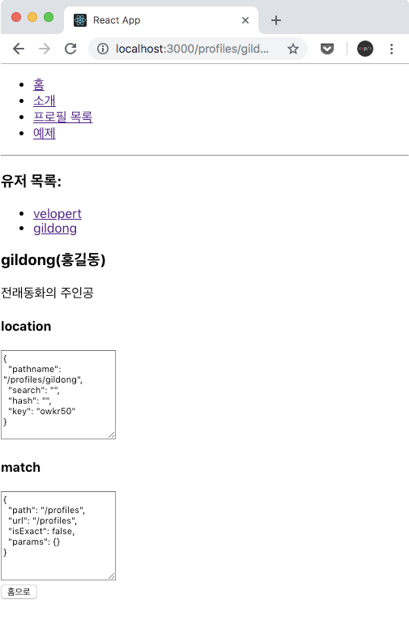

# 리액트 라우터 부가기능

## `history` 객체

개발을 하면서 뒤로가기, 특정 경로로 이동하기, 이탈 방지 등 컴포넌트 내의 메서드에서 라우터에 직접 접근을 하고 싶을 때 `history` 객체를 사용합니다.

`history`는 `match`, `location` 과 같이 라우트로 사용된 컴포넌트에게 전달되는 `props` 중 하나 입니다.

`history`를 사용하는 예제 페이지를 보겠습니다.

### HistorySample.js

```jsx
import React, { useEffect } from 'react';

function HistorySample({ history }) {
  const goBack = () => {
    // goBack은 뒤로가기 역할을 합니다.
    history.goBack();
  };

  const goHome = () => {
    // push 안의 담겨있는 경로로 이동합니다.
    history.push('/');
  };

  useEffect(() => {
    console.log(history);

    // HistorySample이 Unmount 될 때, 정말 떠나려고 하는지를 물어보는 알림창을 띄워줍니다.
    const unblock = history.block('정말 떠나실건가요?');
    return () => {
      unblock();
    };
  }, [history]);

  return (
    <div>
      <button onClick={goBack}>뒤로가기</button>
      <button onClick={goHome}>홈으로</button>
    </div>
  );
}
```

### App.js

```jsx
import React from 'react';
import { Route, Link } from 'react-router-dom';
import About from './About';
import Home from './Home';
import Profiles from './Profiles';
import HistorySample from './HistorySample';

const App = () => {
  return (
    <div>
      <ul>
        <li>
          <Link to="/">홈</Link>
        </li>
        <li>
          <Link to="/about">소개</Link>
        </li>
        <li>
          <Link to="/profiles">프로필 목록</Link>
        </li>
        <li>
          <Link to="/history">예제</Link>
        </li>
      </ul>
      <hr />
      <Route path="/" exact={true} component={Home} />
      <Route path="/about" component={About} />
      <Route path="/profiles" component={Profiles} />

      {/*'/history' 경로에 HistorySample 컴포넌트를 출력해줍니다.*/}
      <Route path="/history" component={HistorySample} />
    </div>
  );
};

export default App;
```

## withRouter HoC

라우트 컴포넌트 안에서는 자동으로 `location` / `match` / `history` 가 `props`로 전달되었습니다.

하지만 라우트 컴포넌트가 아닌 곳에서도 위의 `props`를 사용하고 싶을 수 있죠.

이때 `withRouter`를 사용하면 됩니다.

### WithRouterSample.js

```jsx
import React from 'react';
import { withRouter } from 'react-router-dom';

const WithRouterSample = ({ location, match, history }) => {
  return (
    <div>
      <h4>location</h4>
      <textarea value={JSON.stringify(location, null, 2)} readOnly />

      <h4>match</h4>
      <textarea value={JSON.stringify(match, null, 2)} readOnly />

      <button onClick={() => history.push('/')}>홈으로</button>
    </div>
  );
};

// 라우터 컴포넌트가 이닐 때 그냥 이렇게 withRouter에 감싸서 export 해주면 사용할 수 있습니다.
export default withRouter(WithRouterSample);
```

Profiles.js에서 렌더링 해보겠습니다.

### Profiles.js

```jsx
import React from 'react';
import { Link, Route } from 'react-router-dom';
import Profile from './Profile';
import WithRouterSample from './WithRouterSample';

const Profiles = () => {
  return (
    <div>
      <h3>유저 목록:</h3>
      <ul>
        <li>
          <Link to="/profiles/velopert">velopert</Link>
        </li>
        <li>
          <Link to="/profiles/gildong">gildong</Link>
        </li>
      </ul>

      <Route path="/profiles" exact render={() => <div>유저를 선택해주세요.</div>} />
      <Route path="/profiles/:username" component={Profile} />

      {/* 이것만 추가된겁니다. 보다시피 라우터가 아닌 일반 컴포넌트의 형태입니다. */}
      <WithRouterSample />
    </div>
  );
};

export default Profiles;
```



보면 Profiles 에서 gildong Link를 클릭해서 url params에 gildong이 분명히 있는 상태이지만,

match 내부의 params는 비어있는 상태인 것을 볼 수 있습니다.

왜냐하면 match의 경우에는 현재 자신이 렌더링된 위치를 기준으로 값을 받아오기 때문에,

Profiles에서 렌더링된 WithRouterSample의 params는 비어있게 되는 것 입니다.

(다시 말해, WithRouterSample의 params는 Profiles의 params와 같습니다.

Profiles에서는 따로 url params를 받지 않기 때문에 WithRouterSample의 params도 비어있게 되는 것입니다.)

따라서 WithRouterSample에서 params를 불러오고 싶다면 Profiles.js에서 렌더링하는 것이 아니라 Profile.js에서 불러오면 됩니다.

코드샌드박스: [https://codesandbox.io/s/k5y28vlk8r](https://codesandbox.io/s/k5y28vlk8r)

## Switch

Switch는 여러 Route 들을 감싸서 규칙이 일치하는 라우트 **하나만 렌더링 시켜줍니다.**

Switch 를 사용해 path가 아무것도 일치하지 않았을 때 보여줄 Not found 페이지를 만들어 줄 수 있습니다.

예시코드를 보겠습니다.

### App.js

```jsx
//... 기존 코드

<Switch>
  <Route path="/" exact={true} component={Home} />
  <Route path="/about" component={About} />
  <Route path="/profiles" component={Profiles} />
  <Route path="/history" component={HistorySample} />
  <Route
    // path 를 따로 정의하지 않으면 모든 상황에 렌더링됩니다.
    render={({ location }) => (
      <div>
        <h2>이 페이지는 존재하지 않습니다:</h2>
        <p>{location.pathname}</p>
      </div>
    )}
  />
</Switch>
```

입력된 path가 Switch에 감싸진 Route의 path 중 어떤 것과도 일치하지 않으면 path 없이 지정한 Not found 페이지가 렌더링 됩니다.

## NavLink

Link와 기본적으로 같습니다.

NavLink에서는 현재 경로와 to 값이 일치한다면 특정 스타일 혹은 클래스를 적용할 수 있는 컴포넌트입니다.

Profiles 컴포넌트에서 Link를 NavLink로 바꾸어 선택되었을 때 색을 바꾸도록 만들어보겠습니다.

### Profiles.js

```jsx
import React from 'react';
import { Route, NavLink } from 'react-router-dom';
import Profile from './Profile';
import WithRouterSample from './WithRouterSample';

const Profiles = () => {
  return (
    <div>
      <h3>유저 목록:</h3>
      <ul>
        <li>
          <NavLink to="/profiles/velopert" activeStyle={{ background: 'black', color: 'white' }}>
            velopert
          </NavLink>
        </li>
        <li>
          <NavLink to="/profiles/gildong" activeStyle={{ background: 'black', color: 'white' }}>
            gildong
          </NavLink>
        </li>
      </ul>

      <Route path="/profiles" exact render={() => <div>유저를 선택해주세요.</div>} />
      <Route path="/profiles/:username" component={Profile} />
      <WithRouterSample />
    </div>
  );
};

export default Profiles;
```

코드 샌드박스: [https://codesandbox.io/s/router-tutorial-pmtve?fontsize=14](https://codesandbox.io/s/router-tutorial-pmtve?fontsize=14)

## Redirect

`history.push('')` 를 컴포넌트 형태로 구현했습니다.

즉 새로운 location으로 이동할 수 있도록 해줍니다.

```jsx
<Route exact path="/">
  {loggedIn ? <Redirect to="/dashboard" /> : <LoginPage />}
</Route>
```

어떤 조건에 따라 가고자 하는 페이지가 달라질 때 많이 사용하는 것 같습니다.

(로그인 처리를 할 때 `loggedIn = ture` 라면 `dashboard`를 `false`라면 다시 `LoginPage`로 이동하도록 만들기 )

Q. history.push('')와 Redirect의 차이점은 무엇인가?

1. Redirect는 현재 주소에 override되기 때문에 history stack에 쌓이지 않는 반면에, push는 history stack의 new entry에 결과가 쌓이게 된다. (그럼 history.replace랑 같은 것이 아닌가?)
2. history를 사용하기 위해서는 WithRouter나 useHistory를 사용해야 하지만, Redirect는 신경쓰지 않고 사용할 수 있다.
3. Redirect는 jsx형태로 리턴해줄때 더 간편하다?.. (내생각)

[https://stackoverflow.com/questions/48619733/react-router-redirect-vs-history-push](https://stackoverflow.com/questions/48619733/react-router-redirect-vs-history-push)

## UseHistory()

저희는 WithRouter HoC를 사용하여 Route 컴포넌트가 아닌 일반 컴포넌트에서도

history / location / match 가 사용이 가능했습니다.

하지만 props에서 받아올 객체를 표기하고 export 할 때 HoC를 감싸는 것이 별로 예쁘지 않다(?)고 느껴졌습니다.

또한 WithRouter에 더해 다른 HoC들이 컴포넌트를 감싼다면 서로 충돌할 우려도 있습니다.

위의 문제들을 해결해줄 수 있는 react-router-dom hooks가 useHistory입니다.

사용법을 보겠습니다.

```jsx
import React from 'react';
import { useHistory } from 'react-router-dom';

const Home = (): JSX.Element => {
  const history = useHistory();
  // history를 props에서 얻어왔을 때 처럼 동일하게 사용 가능하다.

  return (
    <div onClick={() => history.push('/auth')}>
      <div>Hello!</div>
    </div>
  );
};

export default Home;
// withRouter hoc가 필요없다.
```

너무 쉽습니다. 변수에 useHistory()를 담아주면 WithRouter에서 사용하던 history와 똑같이 사용하면 되겠습니다.

useHistory 뿐만 아니라 당연히 location과 match도 useLocation 과 useParams가 있습니다.

더 알아보기: [https://velog.io/@yiyb0603/React-Router-dom의-유용한-hooks들](https://velog.io/@yiyb0603/React-Router-dom%EC%9D%98-%EC%9C%A0%EC%9A%A9%ED%95%9C-hooks%EB%93%A4)
