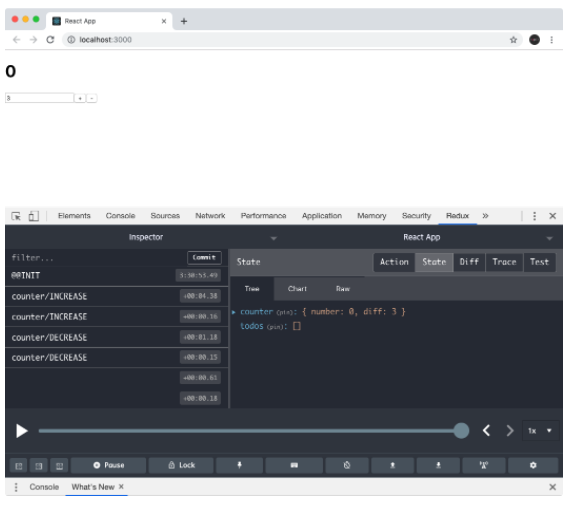
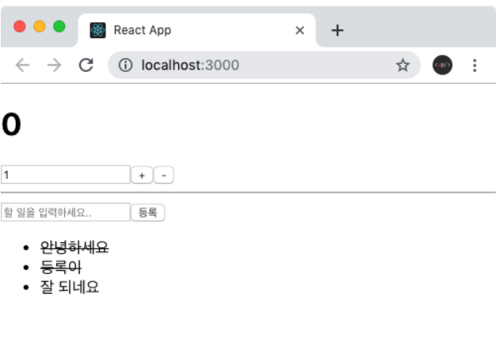
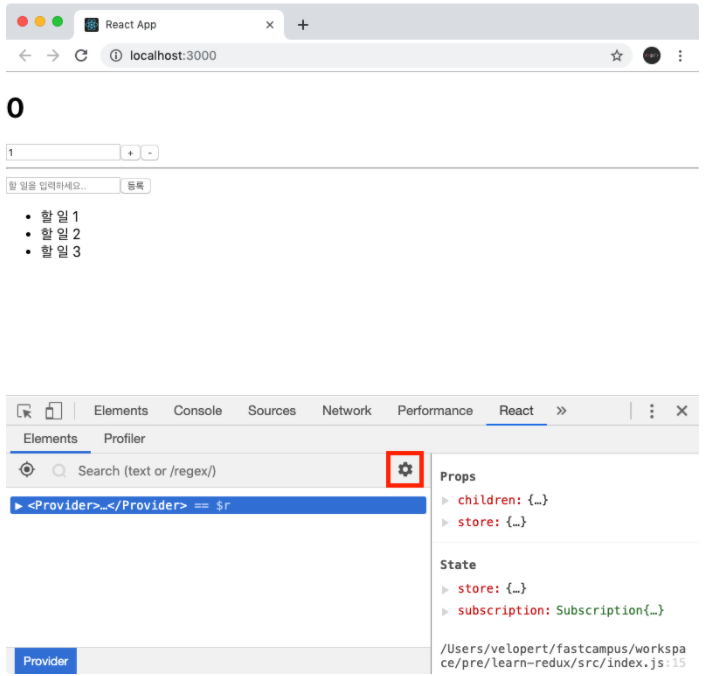
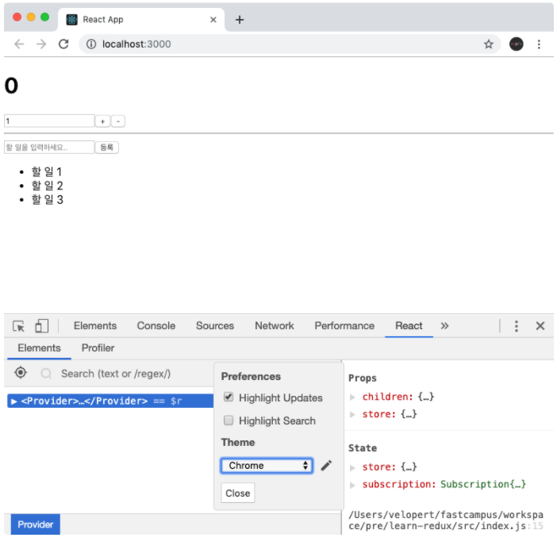
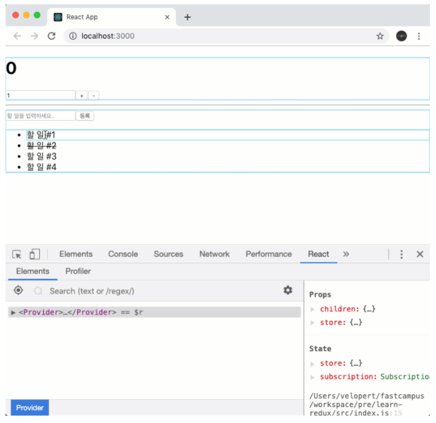

# 1. 리덕스 개발자 도구 사용하기

아래 리덕스 개발자 도구를 사용하면 현재 스토어의 상태를 개발자 도구에서 조회 할 수 있고 지금까지 어떤 액션들이 디스패치 되었는지, 그리고 액션에 따라 상태가 어떻게 변화했는지 확인 할 수 있습니다. 추가적으로, 액션을 직접 디스패치 할 수도 있습니다.



리덕스 devtool은 크롭 웹 스토어에서 Redux DevTools 이름의 확장 프로그램을 설치합니다.

그리고 아래 index.js 파일에 Redux DevTools를 불러옵니다.

**index.js**

```jsx
import React from "react";
import ReactDOM from "react-dom";
import "./index.css";
import App from "./App";
import * as serviceWorker from "./serviceWorker";
import { createStore } from "redux";
import { Provider } from "react-redux";
import rootReducer from "./modules";
import { composeWithDevTools } from "redux-devtools-extension"; // 리덕스 개발자 도구

const store = createStore(rootReducer, composeWithDevTools()); // 스토어를 만듭니다.
// composeWithDevTools 를 사용하여 리덕스 개발자 도구 활성화

ReactDOM.render(
  <Provider store={store}>
    <App />
  </Provider>,
  document.getElementById("root")
);

serviceWorker.unregister();
```

# 2. 할 일 목록 구현하기

**components/Todos.js**

```jsx
import React, { useState } from "react";

// 컴포넌트 최적화를 위하여 React.memo를 사용합니다
const TodoItem = React.memo(function TodoItem({ todo, onToggle }) {
  return (
    <li
      style={{ textDecoration: todo.done ? "line-through" : "none" }}
      onClick={() => onToggle(todo.id)}
    >
      {todo.text}
    </li>
  );
});

// 컴포넌트 최적화를 위하여 React.memo를 사용합니다
const TodoList = React.memo(function TodoList({ todos, onToggle }) {
  return (
    <ul>
      {todos.map((todo) => (
        <TodoItem key={todo.id} todo={todo} onToggle={onToggle} />
      ))}
    </ul>
  );
});

function Todos({ todos, onCreate, onToggle }) {
  // 리덕스를 사용한다고 해서 모든 상태를 리덕스에서 관리해야하는 것은 아닙니다.
  const [text, setText] = useState("");
  const onChange = (e) => setText(e.target.value);
  const onSubmit = (e) => {
    e.preventDefault(); // Submit 이벤트 발생했을 때 새로고침 방지
    onCreate(text);
    setText(""); // 인풋 초기화
  };

  return (
    <div>
      <form onSubmit={onSubmit}>
        <input
          value={text}
          placeholder="할 일을 입력하세요.."
          onChange={onChange}
        />
        <button type="submit">등록</button>
      </form>
      <TodoList todos={todos} onToggle={onToggle} />
    </div>
  );
}

export default Todos;
```

**TodosContainer.js**

```jsx
import React, { useCallback } from "react";
import { useSelector, useDispatch } from "react-redux";
import Todos from "../components/Todos";
import { addTodo, toggleTodo } from "../modules/todos";

function TodosContainer() {
  // useSelector 에서 꼭 객체를 반환 할 필요는 없습니다.
  // 한 종류의 값만 조회하고 싶으면 그냥 원하는 값만 바로 반환하면 됩니다.
  const todos = useSelector((state) => state.todos);
  const dispatch = useDispatch();

  const onCreate = (text) => dispatch(addTodo(text));
  const onToggle = useCallback((id) => dispatch(toggleTodo(id)), [dispatch]); // 최적화를 위해 useCallback 사용

  return <Todos todos={todos} onCreate={onCreate} onToggle={onToggle} />;
}

export default TodosContainer;
```

**app.js**

```jsx
import React from "react";
import CounterContainer from "./containers/CounterContainer";
import TodosContainer from "./containers/TodosContainer";

function App() {
  return (
    <div>
      <CounterContainer />
      <hr />
      <TodosContainer />
    </div>
  );
}

export default App;
```



# 3. useSelector 최적화







기본적으로, `useSelector`를 사용해서 리덕스 스토어의 상태를 조회 할 땐 만약 상태가 바뀌지 않았으면 리렌더링하지 않습니다.

TodosContainer 의 경우 카운터 값이 바뀔 때 `todos` 값엔 변화가 없으니까, 리렌더링되지 않습니다.

```jsx
const todos = useSelector((state) => state.todos);
```

CounterContainer에서는 사실상 `useSelector` Hook 을 통해 매번 렌더링 될 때마다 새로운 객체 `{ number, diff }`를 만드는 것이기 때문에 상태가 바뀌었는지 바뀌지 않았는지 확인을 할 수 없어서 낭비 렌더링이 이루어지고 있는 것 입니다.

이를 최적화 하기 위해선 두가지 방법이 있습니다.

첫번째는, `useSelector` 를 여러번 사용하는 것 입니다.

```jsx
const number = useSelector((state) => state.counter.number);
const diff = useSelector((state) => state.counter.diff);
```

두번째는, react-redux의 shallowEqual 함수를 useSelector의 두번째 인자로 전달해주는 것 입니다.

```jsx
import React from 'react';
import { useSelector, useDispatch, shallowEqual } from 'react-redux';
import Counter from '../components/Counter';
import { increase, decrease, setDiff } from '../modules/counter';

function CounterContainer() {
  // useSelector는 리덕스 스토어의 상태를 조회하는 Hook입니다.
  // state의 값은 store.getState() 함수를 호출했을 때 나타나는 결과물과 동일합니다.
  const { number, diff } = useSelector(
    state => ({
      number: state.counter.number,
      diff: state.counter.diff
    }),
    shallowEqual
  );

  (...)
```

```jsx
equalityFn?: (left: any, right: any) => boolean
```

useSelector 의 두번째 파라미터는 equalityFn 입니다.

이전 값과 다음 값을 비교하여 `true`가 나오면 리렌더링을 하지 않고 `false`가 나오면 리렌더링을 합니다.

`shallowEqual`은 react-redux에 내장되어있는 함수로서, 객체 안의 가장 겉에 있는 값들을 모두 비교해줍니다.

여기서 겉에 있는 값이란, 만약 다음과 같은 객체가 있다면

```jsx
const object = {
  a: {
    x: 3,
    y: 2,
    z: 1,
  },
  b: 1,
  c: [{ id: 1 }],
};
```

가장 겉에 있는 값은 object.a, object.b, object.c 입니다. shallowEqual 에서는 해당 값들만 비교하고 object.a.x 또는 object.c[0] 값은 비교하지 않습니다.

# 4. connect 함수

`[connect]` 함수는 컨테이너 컴포넌트를 만드는 또 다른 방법입니다. 리덕스를 사용하면서 connect 함수는 많이 사용할 일은 없습니다. 이유는 `useSelector`, `useDispatch`가 워낙 편하기 때문입니다.

리액트 컴포넌트를 만들 때에는 함수형 컴포넌트로 만드는 것을 우선시해야 하고, 꼭 필요할 때에만 클래스형 컴포넌트로 작성을 해야 합니다. 만약 클래스형 컴포넌트로 작성을 하게 되는 경우에는 Hooks 를 사용하지 못하기 때문에 `connect` 함수를 사용해야 됩니다.

추가적으로, 2019년 이전에 작성된 리덕스와 연동된 컴포넌트들은 `connect` 함수로 작성되었을 것입니다. `connect` 함수가 사라지는 것은 아니기 때문에 옛날에 만든 컨테이너 컴포넌트들을 함수형으로 변환을 하실 필요는 없습니다. 나중에 리액트 프로젝트를 유지보수하게 될 일이 있다면 `connect` 함수를 종종 접하게 될 수 있습니다.

## 4-1. **HOC란?**

`connect`는 [HOC]입니다. HOC란, Higher-Order Component 를 의미합니다. 이는 리액트 컴포넌트를 개발하는 하나의 패턴으로써, 컴포넌트의 로직을 재활용 할 때 유용한 패턴입니다. 예를 들어서, 특정 함수 또는 값을 props 로 받아와서 사용하고 싶은 경우에 이러한 패턴을 사용합니다. 리액트에 Hook이 도입되기 전에는 HOC 패턴이 자주 사용되어왔으나, 리액트에 Hook 이 도입된 이후에는 HOC를 만들 이유가 없어졌습니다. 대부분의 경우 Hook으로 대체 할 수 있기 때문입니다.

HOC를 직접 구현하게 되는 일은 거의 없기 때문에 HOC의 용도는 "컴포넌트를 특정 함수로 감싸서 특정 값 또는 함수를 props로 받아와서 사용 할 수 있게 해주는 패턴"이라는 것 정도만 알아두면 좋습니다.

## 4-2. **connect 사용해보기**

`connect` 함수는 리덕스 스토어안에 있는 상태를 props로 넣어줄수도있고, 액션을 디스패치하는 함수를 props 로 넣어줄수도 있습니다.

**containers/TodosContainer.js**

```jsx
import React, { useCallback } from "react";
import { connect } from "react-redux";
import Todos from "../components/Todos";
import { addTodo, toggleTodo } from "../modules/todos";

function TodosContainer({ todos, addTodo, toggleTodo }) {
  const onCreate = (text) => addTodo(text);
  const onToggle = useCallback((id) => toggleTodo(id), [toggleTodo]); // 최적화를 위해 useCallback 사용

  return <Todos todos={todos} onCreate={onCreate} onToggle={onToggle} />;
}

export default connect((state) => ({ todos: state.todos }), {
  addTodo,
  toggleTodo,
})(TodosContainer);
```

## 4-3. **connect, 알아둬야 하는 것들**

**1. [mapStateToProps] 의 두번째 파라미터 ownProps**

`mapStateToProps`에서는 두번째 파라미터 `ownProps`를 받아올 수 있습니다. 이 파라미터는 생략해도 되는 파라미터이고, 이 값은 컨테이너 컴포넌트를 렌더링 할때 직접 넣어주는 `props` 를 가르킵니다. 예를 들어서

`<CounterContainer myValue={1} />` 이라고 하면 `{ myValue: 1 }` 값이 `ownProps`가 됩니다.

```jsx
const mapStateToProps = (state, ownProps) => ({
  todo: state.todos[ownProps.id],
});
```

리덕스에서 어떤 상태를 조회 할 지 설정하는 과정에서 현재 받아온 props에 따라 다른 상태를 조회 할 수 있습니다.

### **2. connect 의 3번째 파라미터 [mergeProps](https://react-redux.js.org/api/connect#mergeprops-stateprops-dispatchprops-ownprops-object)**

`mergeProps`는 `connect` 함수의 세번째 파라미터이며, 생략해도 되는 파라미터입니다. 이 파라미터는 컴포넌트가 실제로 전달받게 될 `props` 를 정의합니다.

```jsx
(stateProps, dispatchProps, ownProps) => Object;
```

이 함수를 따로 지정하지 않으면 결과는 `{ ...ownProps, ...stateProps, ...dispatchProps }` 입니다.

### **3. connect의 4번째 파라미터 [options](https://react-redux.js.org/api/connect#options-object)**

`connect` 함수를 사용 할 때 이 컨테이너 컴포넌트가 어떻게 동작할지에 대한 옵션을 4번째 파라미터를 통해 설정 할 수 있습니다. 이는 생략해도 되는 파라미터입니다. 이 옵션들은 따로 커스터마이징하게 되는일이 별로 없습니다. 자세한 내용은 링크를 [참조](https://react-redux.js.org/api/connect#options-object)하세요. 이 옵션을 통하여 Context 커스터마이징, 최적화를 위한 비교 작업 커스터마이징, 및 ref 관련 작업을 할 수 있습니다.
