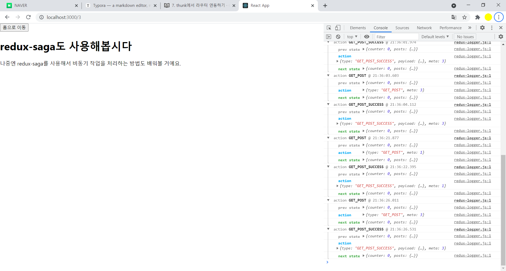
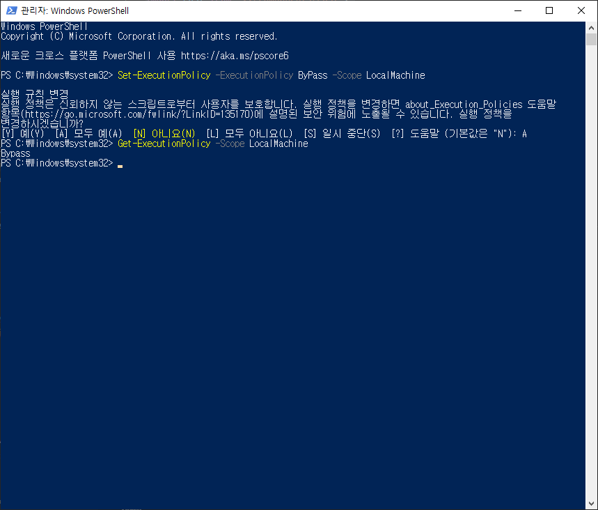
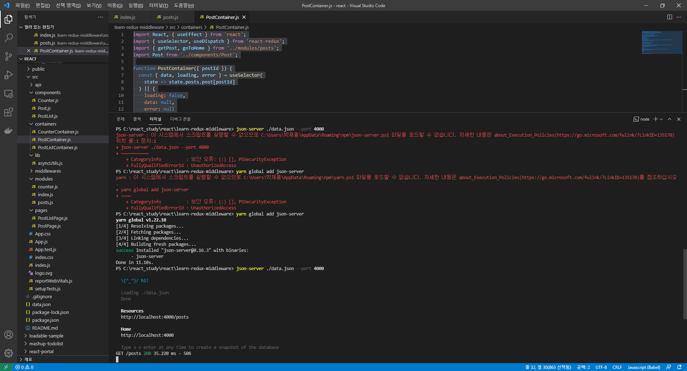
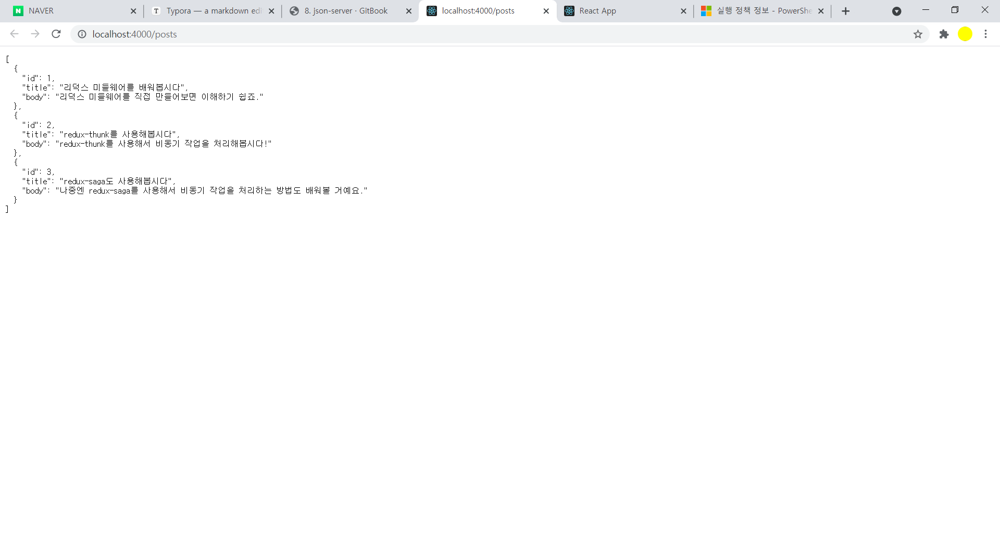
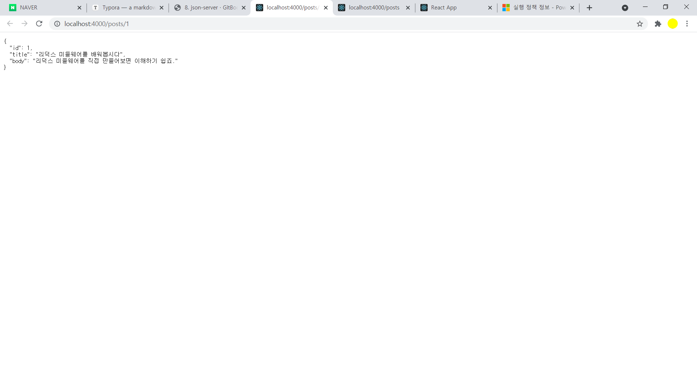
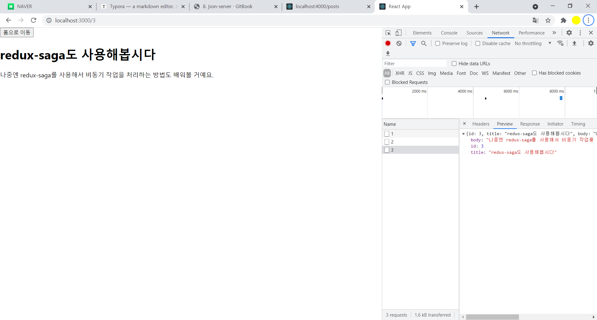
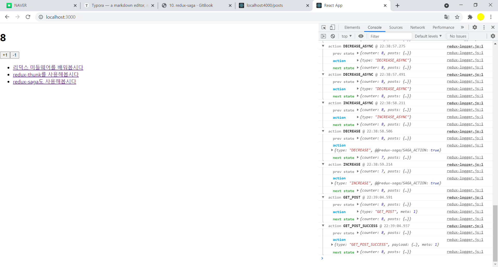

## thunk에서 router연동


### customHistory 만들어서 적용하기

- thunk에서 라우터의 history객채를 사용하려면, BrowserHistory 인스턴스를 직접 만들어서 적용해야 한다.

#### Index.js

```react
import React from 'react';
import ReactDOM from 'react-dom';
import './index.css';
import App from './App';
import reportWebVitals from './reportWebVitals';
import { createStore, applyMiddleware } from 'redux';
import { Provider } from 'react-redux';
import rootReducer from './modules';
//import myLogger from './middlewares/myLogger';
import logger from 'redux-logger';
import { composeWithDevTools } from 'redux-devtools-extension';
import ReduxThunk from 'redux-thunk';
//import { BrowserRouter } from 'react-router-dom';
import { Router } from 'react-router-dom';
import { createBrowserHistory } from 'history';

const customHistory = createBrowserHistory();

// const store = createStore(
//   rootReducer,
//   // logger 를 사용하는 경우, logger가 가장 마지막에 와야합니다.
//   composeWithDevTools(applyMiddleware(ReduxThunk, logger))
// ); // 여러개의 미들웨어를 적용 할 수 있습니다.

//store instance 생성
const store = createStore(
 rootReducer, 
   composeWithDevTools(
     applyMiddleware(
       ReduxThunk.withExtraArgument({history: customHistory}), logger)));

ReactDOM.render(
  <Router history={customHistory}>
    <Provider store={store}>
      <App />
    </Provider>
  </Router>,
  document.getElementById('root')
);

// If you want to start measuring performance in your app, pass a function
// to log results (for example: reportWebVitals(console.log))
// or send to an analytics endpoint. Learn more: https://bit.ly/CRA-vitals
reportWebVitals();

```


- 

#### modules/posts.js

```react
import * as postsAPI from '../api/posts'; // api/posts 안의 함수 모두 불러오기
import { createPromiseThunk, reducerUtils, handleAsyncActions, createPromiseThunkById, handleAsyncActionsById } from '../lib/asyncUtils';

/* 액션 타입 */

// 포스트 여러개 조회하기
const GET_POSTS = 'GET_POSTS'; // 요청 시작
const GET_POSTS_SUCCESS = 'GET_POSTS_SUCCESS'; // 요청 성공
const GET_POSTS_ERROR = 'GET_POSTS_ERROR'; // 요청 실패

// 포스트 하나 조회하기
const GET_POST = 'GET_POST';
const GET_POST_SUCCESS = 'GET_POST_SUCCESS';
const GET_POST_ERROR = 'GET_POST_ERROR';

// 포스트 비우기
//const CLEAR_POST = 'CLEAR_POST';

// 아주 쉽게 thunk 함수를 만들 수 있게 되었습니다.
export const getPosts = createPromiseThunk(GET_POSTS, postsAPI.getPosts);
export const getPost = createPromiseThunkById(GET_POST, postsAPI.getPostById);

//export const clearPost = () => ({ type: CLEAR_POST });

// thunk 를 사용 할 때, 꼭 모든 액션들에 대하여 액션 생성함수를 만들 필요는 없습니다.
// 그냥 thunk 함수에서 바로 액션 객체를 만들어주어도 괜찮습니다.

// export const getPosts = () => async dispatch => {
//   dispatch({ type: GET_POSTS }); // 요청이 시작됨
//   try {
//     const posts = await postsAPI.getPosts(); // API 호출
//     dispatch({ type: GET_POSTS_SUCCESS, posts }); // 성공
//   } catch (e) {
//     dispatch({ type: GET_POSTS_ERROR, error: e }); // 실패
//   }
// };

// // thunk 함수에서도 파라미터를 받아와서 사용 할 수 있습니다.
// export const getPost = id => async dispatch => {
//   dispatch({ type: GET_POST }); // 요청이 시작됨
//   try {
//     const post = await postsAPI.getPostById(id); // API 호출
//     dispatch({ type: GET_POST_SUCCESS, post }); // 성공
//   } catch (e) {
//     dispatch({ type: GET_POST_ERROR, error: e }); // 실패
//   }
// };

const initialState = {
//   posts: {
//     loading: false,
//     data: null,
//     error: null
//   },
//   post: {
//     loading: false,
//     data: null,
//     error: null
//   }
//  posts: reducerUtils.initial(),
//  post: reducerUtils.initial()
  posts: reducerUtils.initial(),
  post: {}
 };

export default function posts(state = initialState, action) {
  switch (action.type) {
    case GET_POSTS:
    case GET_POSTS_SUCCESS:
    case GET_POSTS_ERROR:
      return handleAsyncActions(GET_POSTS,'posts', true)(state, action);
    case GET_POST:
    case GET_POST_SUCCESS:
    case GET_POST_ERROR:
      return handleAsyncActionsById(GET_POST,'post', true)(state, action);
    //case CLEAR_POST:
    //  return {
    //    ...state,
    //    post: reducerUtils.initial()
    //  };
    default:
      return state;
  }
}
// 3번째 인자를 사용하면 withExtraArgument 에서 넣어준 값들을 사용 할 수 있습니다.
//홈 화면으로 가는 thunk 만들기
export const goToHome = () => (dispatch, getState, { history }) => {
  history.push('/');
};
```


- thunk 를 디스패치

#### containers/PostContainer.js

```react
import React, { useEffect } from 'react';
import { useSelector, useDispatch } from 'react-redux';
import { getPost, goToHome } from '../modules/posts';
import Post from '../components/Post';

function PostContainer({ postId }) {
  const { data, loading, error } = useSelector(
    state => state.posts.post[postId]
  ) || {
    loading: false,
    data: null,
    error: null
  }; // 아예 데이터가 존재하지 않을 때가 있으므로, 비구조화 할당이 오류나지 않도록
  const dispatch = useDispatch();

  useEffect(() => {
    dispatch(getPost(postId));
  }, [dispatch, postId]);

  if (loading && !data) return <div>로딩중...</div>; // 로딩중이고 데이터 없을때만
  if (error) return <div>에러 발생!</div>;
  if (!data) return null;

   return (
    <>
      <button onClick={() => dispatch(goToHome())}>홈으로 이동</button>
      <Post post={data} />
    </>
  );
}

export default PostContainer;
```





## Json-server


- 연습용 api서버 
- firebase(https://firebase.google.com/) : 모바일앱을 만드는데 필요한 여러가지 기능을 갖춘 클라우드 서비스
- 












### axios를 사용하여 API 요청하기


#### api/posts.js

```react
import axios from 'axios';

export const getPosts = async () => {
  const response = await axios.get('http://localhost:4000/posts');
  return response.data;
};

export const getPostById = async id => {
  const response = await axios.get(`http://localhost:4000/posts/${id}`);
  return response.data;
};
```





## CORS와 Webpack DevServer Proxy

- https://developer.mozilla.org/ko/docs/Web/HTTP/CORS#HTTP_%EC%9D%91%EB%8B%B5_%ED%97%A4%EB%8D%94

- 웹팩 개발서버에서 제공하는 proxy기능을 이용 -> package.json의 proxy값 설정

- 개발환경에선 프록시서버쪽으로 요청, production에선 실제 api 서버로 요청


## Redux-saga

- 액션을 모니터링 하고 있다가 특정 액션이 발생하면 이에 따라 특정작업을 하는 방식으로 사용
- 다양한 비동기 작업 처리 가능

  

#### Generator 문법 배우기

- 제너레이터 함수를 만들 때에는 `function*` 이라는 키워드를 사용
- 제너레이터 함수를 호출한다고 해서 해당 함수 안의 코드가 바로 시작되지는 않고 `generator.next()` 를 호출해야만 코드가 실행되며, `yield`를 한 값을 반환후 코드의 흐름을 멈춤
- 코드의 흐름이 멈추고 나서 `generator.next()` 를 다시 호출하면 흐름이 이어서 다시 시작
- `next` 를 호출 할 때 인자를 전달하여 이를 제너레이터 함수 내부에서 사용 가능


#### Generator로 액션 모니터링하기

- 특정 액션이 발생했을때 우리가 원하는 자바스크립트 코드를 실행


#### modules/counter.js

```react
import { delay, put, takeEvery, takeLatest } from 'redux-saga/effects';

// 액션 타입
const INCREASE = 'INCREASE';
const DECREASE = 'DECREASE';
const INCREASE_ASYNC = 'INCREASE_ASYNC';
const DECREASE_ASYNC = 'DECREASE_ASYNC';

// 액션 생성 함수
export const increase = () => ({ type: INCREASE });
export const decrease = () => ({ type: DECREASE });
export const increaseAsync = () => ({ type: INCREASE_ASYNC });
export const decreaseAsync = () => ({ type: DECREASE_ASYNC });

function* increaseSaga() {
  yield delay(1000); // 1초를 기다립니다.
  yield put(increase()); // put은 특정 액션을 디스패치 해줍니다.
}
function* decreaseSaga() {
  yield delay(1000); // 1초를 기다립니다.
  yield put(decrease()); // put은 특정 액션을 디스패치 해줍니다.
}

export function* counterSaga() {
  yield takeEvery(INCREASE_ASYNC, increaseSaga); // 모든 INCREASE_ASYNC 액션을 처리
  yield takeLatest(DECREASE_ASYNC, decreaseSaga); // 가장 마지막으로 디스패치된 DECREASE_ASYNC 액션만을 처리
}

// 초깃값 (상태가 객체가 아니라 그냥 숫자여도 상관 없습니다.)
const initialState = 0;

export default function counter(state = initialState, action) {
  switch (action.type) {
    case INCREASE:
      return state + 1;
    case DECREASE:
      return state - 1;
    default:
      return state;
  }
}
```

- 

  

#### modules/index.js

```react
import { combineReducers } from 'redux';
import counter, { counterSaga } from './counter';
import posts from './posts';
import { all } from 'redux-saga/effects';

const rootReducer = combineReducers({ counter, posts });
export function* rootSaga() {
  yield all([counterSaga()]); // all 은 배열 안의 여러 사가를 동시에 실행시켜줍니다.
}

export default rootReducer;
```


#### index.js

```react
import React from 'react';
import ReactDOM from 'react-dom';
import './index.css';
import App from './App';
import reportWebVitals from './reportWebVitals';
import { createStore, applyMiddleware } from 'redux';
import { Provider } from 'react-redux';
import rootReducer , { rootSaga } from './modules';
import logger from 'redux-logger';
import { composeWithDevTools } from 'redux-devtools-extension';
import ReduxThunk from 'redux-thunk';
import { Router } from 'react-router-dom';
import { createBrowserHistory } from 'history';
import createSagaMiddleware from 'redux-saga';

const customHistory = createBrowserHistory();
const sagaMiddleware = createSagaMiddleware(); // 사가 미들웨어를 만듭니다.

const store = createStore(
 rootReducer, 
   composeWithDevTools(
     applyMiddleware(
       ReduxThunk.withExtraArgument({history: customHistory}), 
        sagaMiddleware, // 사가 미들웨어를 적용하고
       logger)));

sagaMiddleware.run(rootSaga); // 루트 사가를 실행해줍니다.
// 주의: 스토어 생성이 된 다음에 위 코드를 실행해야합니다.

ReactDOM.render(
  <Router history={customHistory}>
    <Provider store={store}>
      <App />
    </Provider>
  </Router>,
  document.getElementById('root')
);

// If you want to start measuring performance in your app, pass a function
// to log results (for example: reportWebVitals(console.log))
// or send to an analytics endpoint. Learn more: https://bit.ly/CRA-vitals
reportWebVitals();

```


#### App.js

```react
import React from 'react';
import { Route } from 'react-router-dom';
import PostListPage from './pages/PostListPage';
import PostPage from './pages/PostPage';
import CounterContainer from './containers/CounterContainer';

function App() {
  return (
    <>
     <CounterContainer />
      <Route path="/" component={PostListPage} exact={true} />
      <Route path="/:id" component={PostPage} />
    </>
  );
}

export default App;
```




- 
- 


## Resux-saga로 Promise 다루기


#### modules/posts.js

```react
import * as postsAPI from '../api/posts'; // api/posts 안의 함수 모두 불러오기
import {
  reducerUtils,
  handleAsyncActions,
  handleAsyncActionsById
} from '../lib/asyncUtils';
import { call, put, takeEvery } from 'redux-saga/effects';

/* 액션 타입 */

// 포스트 여러개 조회하기
const GET_POSTS = 'GET_POSTS'; // 요청 시작
const GET_POSTS_SUCCESS = 'GET_POSTS_SUCCESS'; // 요청 성공
const GET_POSTS_ERROR = 'GET_POSTS_ERROR'; // 요청 실패

// 포스트 하나 조회하기
const GET_POST = 'GET_POST';
const GET_POST_SUCCESS = 'GET_POST_SUCCESS';
const GET_POST_ERROR = 'GET_POST_ERROR';

export const getPosts = () => ({ type: GET_POSTS });
// payload는 파라미터 용도, meta는 리듀서에서 id를 알기위한 용도
export const getPost = id => ({ type: GET_POST, payload: id, meta: id });

function* getPostsSaga() {
  try {
    const posts = yield call(postsAPI.getPosts); // call 을 사용하면 특정 함수를 호출하고, 결과물이 반환 될 때까지 기다려줄 수 있습니다.
    yield put({
      type: GET_POSTS_SUCCESS,
      payload: posts
    }); // 성공 액션 디스패치
  } catch (e) {
    yield put({
      type: GET_POSTS_ERROR,
      error: true,
      payload: e
    }); // 실패 액션 디스패치
  }
}

// 액션이 지니고 있는 값을 조회하고 싶다면 action을 파라미터로 받아와서 사용 할 수 있습니다.
function* getPostSaga(action) {
  const param = action.payload;
  const id = action.meta;
  try {
    const post = yield call(postsAPI.getPostById, param); // API 함수에 넣어주고 싶은 인자는 call 함수의 두번째 인자부터 순서대로 넣어주면 됩니다.
    yield put({
      type: GET_POST_SUCCESS,
      payload: post,
      meta: id
    });
  } catch (e) {
    yield put({
      type: GET_POST_ERROR,
      error: true,
      payload: e,
      meta: id
    });
  }
}

// 사가들을 합치기
export function* postsSaga() {
  yield takeEvery(GET_POSTS, getPostsSaga);
  yield takeEvery(GET_POST, getPostSaga);
}

// 3번째 인자를 사용하면 withExtraArgument 에서 넣어준 값들을 사용 할 수 있습니다.
export const goToHome = () => (dispatch, getState, { history }) => {
  history.push('/');
};

// initialState 쪽도 반복되는 코드를 initial() 함수를 사용해서 리팩토링 했습니다.
const initialState = {
  posts: reducerUtils.initial(),
  post: reducerUtils.initial()
};

export default function posts(state = initialState, action) {
  switch (action.type) {
    case GET_POSTS:
    case GET_POSTS_SUCCESS:
    case GET_POSTS_ERROR:
      return handleAsyncActions(GET_POSTS, 'posts', true)(state, action);
    case GET_POST:
    case GET_POST_SUCCESS:
    case GET_POST_ERROR:
      return handleAsyncActionsById(GET_POST, 'post', true)(state, action);
    default:
      return state;
  }
}
```


## Resux-saga에서 router 연동하기

